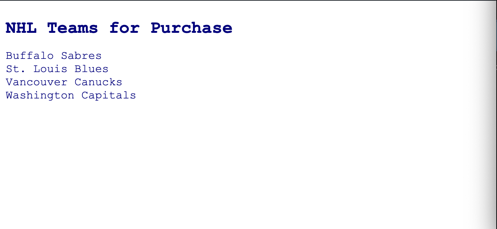
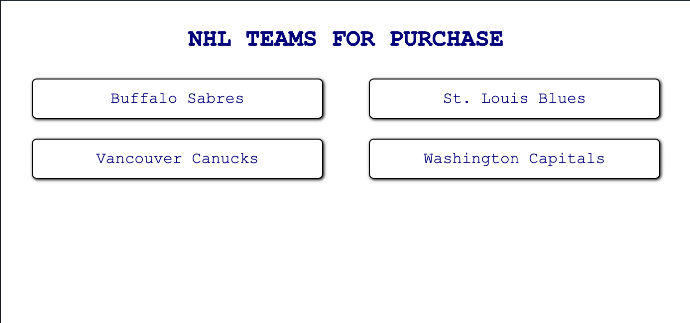

# README #

Please refactor the NHL.html to make it more readable and maintainable.

**IMPORTANT: this code is currently working in production, and we can not change the imported files from the data directory in any way as they are 
not controlled by us.

We have a billionaire client whose passion is to invest in NHL teams that have never won the Stanley Cup.
However, she has a phobia of cities whose name starts with a vowel.
She also has a deep appreciation of history and does not consider any team founded later than 1989 worthy of investment.
She has asked use to write a program that will parse two Javascript files that only she maintains to generate an output of teams that have never
won a Stanley Cup, their city name does not start with a vowel, and they were founded prior to 1990.
She would like this output to be alphabetical (a-z).

After runing the commands
`npm install` 
& `npm start` in the root directory of the react application,

The compiled project should look like this.

Implement CSS to modify the final product to match the following screenshot

This project was bootstrapped with [Create React App](https://github.com/facebook/create-react-app).
